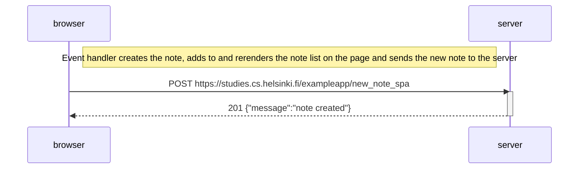

```mermaid
sequenceDiagram
    participant browser
    participant server

    Note right of browser: Event handler creates the note, adds to and rerenders the note list on the page and sends the new note to the server

    browser->>server: POST https://studies.cs.helsinki.fi/exampleapp/new_note_spa
    activate server
    server-->>browser: 201 {"message":"note created"}
    deactivate server
```
